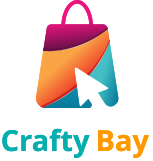

# Crafty Bay - Modern E-Commerce Solution

[](https://flutter.dev/)
[](https://dart.dev/)
[](https://pub.dev/packages/provider)
[](https://opensource.org/licenses/MIT)

Crafty Bay is a sophisticated E-Commerce mobile application built with Flutter, demonstrating industry-standard practices in modular architecture, state management, and user experience. It provides a full shopping lifecycle from authentication to secure checkout.

---

## 🌟 What's New & Improved?

## 📸 Visuals

| Home Screen | Product Details | Cart Management |
| :---: | :---: | :---: |
|  | *Coming Soon* | *Coming Soon* |

---

## ✨ What's New & Engineered

Recent updates focus on **scalability** and **developer efficiency**:

*   **🛡️ Global Auth & Networking**: Integrated a centralized `NetworkCaller` that handles token injection and automatic logout on session expiration (401 Unauthorized), ensuring a secure and seamless user experience.
*   **🌍 Advanced Localization (i18n)**: Implemented full multi-language support (English & Bengali) using `.arb` files and custom `BuildContext` extensions for zero-boilerplate translation access (`context.localization.key`).
*   **🌓 Adaptive UI**: Comprehensive support for Light and Dark modes, managed via a global `ThemeModeProvider` and standardized `AppTheme`.
*   **🛠️ Clean Routing**: Transitioned to a robust `onGenerateRoute` pattern for better navigation control and dynamic argument handling.
*   **🧩 Feature-First Architecture**: Refactored the project into a modular structure where each feature (Auth, Cart, Product, etc.) is self-contained with its own data and presentation layers.

---

## 🏗 Architecture & Engineering

For senior developers, Crafty Bay follows a **Feature-Based Modular Architecture**. This ensures that the codebase remains maintainable as the project grows.

### Design Principles:
-   **Separation of Concerns**: UI (Presentation), Logic (Provider/Controller), and Data (Repository/Models) are strictly separated.
-   **Singleton Network Client**: A custom-built `NetworkCaller` handles all HTTP traffic, ensuring consistent error handling and logging.
-   **Centralized Resource Management**: Assets, colors, and themes are managed in a single `app/` directory to maintain design consistency.

### 🔐 Authentication & Security
- **Email & OTP Flow**: Secure login using Email with Pin Code verification.
- **Persistent Sessions**: User authentication state is managed and persisted across app restarts.

### 🏠 Shopping Experience
- **Dynamic Home**: Interactive carousels, category-based browsing, and "Special/New/Popular" product segments.
- **Product Insights**: Detailed product pages with size/color selection and community reviews.
- **Wishlist**: Save favorites with real-time updates across the app.

| Category | Tools/Libraries |
| :--- | :--- |
| **Framework** | [Flutter](https://flutter.dev/) (3.41.9) |
| **State Management** | [Provider](https://pub.dev/packages/provider) |
| **Network** | `http`, Custom `NetworkCaller` |
| **UI/UX** | `carousel_slider`, `flutter_svg`, `shimmer`, `pin_code_fields` |
| **Storage** | `shared_preferences` |
| **Monitoring** | `firebase_analytics`, `firebase_crashlytics` |
| **Localization** | `intl`, `flutter_localizations` |

---

## 📂 Project Structure (Deep Dive)

Crafty Bay follows a **Modular Feature-based Architecture**, making it easy for senior developers to scale and junior developers to navigate. This structure ensures a clean separation between business logic, data handling, and UI presentation.

```text
lib/
├── app/                        # Global App Configuration & Resources
│   ├── controller/             # Global Business Logic Controllers
│   │   └── auth_controller.dart# User Authentication & Session State
│   ├── extensions/             # Dart Extensions for cleaner code
│   │   └── localization_ext.dart# Zero-boilerplate translation access
│   ├── providers/              # App-wide State Management
│   │   ├── theme_mode_provider.dart # Dynamic Light/Dark Mode switching
│   │   └── language_toggle_provider.dart # Real-time Language toggling
│   ├── app_colors.dart         # Centralized Color Palette
│   ├── app_theme.dart          # Standardized Light/Dark Themes
│   ├── asset_path.dart         # Image/Icon path constants
│   ├── routes.dart             # Dynamic Route Generation (onGenerateRoute)
│   └── urls.dart               # API Endpoints configuration
├── core/                       # Shared Infrastructure & Services
│   ├── service/                # Core Services
│   │   └── network_caller/     # Advanced HTTP Client with Interceptors
│   └── utils/                  # Global Helpers & Constants
├── features/                   # Independent Business Modules (Feature-First)
│   ├── auth/                   # Identity & Access Management
│   │   ├── data/models/        # Auth Data Models
│   │   └── presentation/       # UI Layer (Screens, Widgets, Providers)
│   ├── home/                   # Dashboard & Discovery
│   │   ├── data/models/        # Slider & Category Models
│   │   └── presentation/       # Carousel, Category Chips, etc.
│   ├── product/                # Product Catalog & Insights
│   │   ├── data/models/        # Details, Reviews, List Models
│   │   └── presentation/       # Selection UI, Review Forms
│   ├── cart/                   # Shopping Cart Logic
│   └── wish_list/              # Favorites Management
├── l10n/                       # Internationalization (i18n)
│   ├── app_en.arb              # English Translations
│   └── app_bn.arb              # Bengali Translations
└── main.dart                   # Root Entry Point & Dependency Init
```

---

## 🛠 Tech Stack

| Category | Tools/Libraries |
| :--- | :--- |
| **Framework** | [Flutter](https://flutter.dev/) (3.41.9) |
| **State Management** | [Provider](https://pub.dev/packages/provider) |
| **Network** | `http`, Custom `NetworkCaller` |
| **UI/UX** | `carousel_slider`, `flutter_svg`, `shimmer`, `pin_code_fields` |
| **Storage** | `shared_preferences` |
| **Monitoring** | `firebase_analytics`, `firebase_crashlytics` |
| **Localization** | `intl`, `flutter_localizations` |

---

## ⚙️ Setup & Installation

### Prerequisites
- [Flutter SDK](https://docs.flutter.dev/get-started/install)
- Android Studio / VS Code
- Firebase Project setup

### Steps
1. **Clone the repository:**
   ```bash
   git clone https://github.com/mdrahib46/Crafty-Bay.git
   ```
2. **Install dependencies:**
   ```bash
   flutter pub get
   ```
3. **Firebase Setup:**
   Run `flutterfire configure` or add your `google-services.json` / `GoogleService-Info.plist`.
4. **Run the application:**
   ```bash
   flutter run
   ```

---

## 🤝 Contribution

Contributions are welcome! Feel free to open issues or submit pull requests to improve the platform.

---
*Crafty Bay - Shop with style.*
